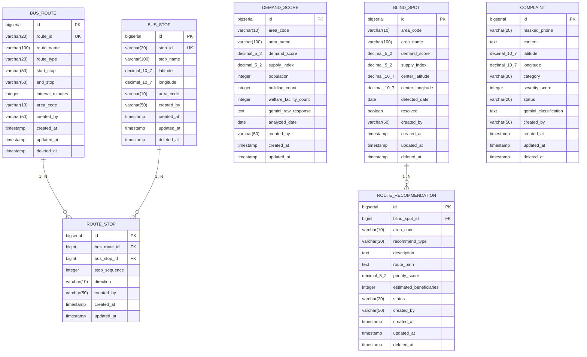

# 원주시 버스 최적화 시스템 ERD



## 관계 설명

| 관계 | 카디널리티 | 설명 |
|------|-----------|------|
| BUS_ROUTE ↔ ROUTE_STOP | 1 : N | 하나의 노선은 여러 정류장을 가짐 |
| BUS_STOP ↔ ROUTE_STOP | 1 : N | 하나의 정류장은 여러 노선에 속할 수 있음 |
| BLIND_SPOT ↔ ROUTE_RECOMMENDATION | 1 : N | 하나의 사각지대에 여러 추천이 생성될 수 있음 |
| DEMAND_SCORE ↔ BLIND_SPOT | 논리적 연관 (area_code) | FK 없음, 배치 수행 시 area_code 기준 매핑 |

## 소프트 삭제 (Soft Delete)

`deleted_at` 컬럼이 있는 엔티티에는 `@SQLRestriction("deleted_at IS NULL")` 적용.

해당 엔티티: `BUS_ROUTE`, `BUS_STOP`, `BLIND_SPOT`, `COMPLAINT`, `ROUTE_RECOMMENDATION`

## 공통 컬럼 (BaseEntity)

모든 엔티티 공통:

| 컬럼 | 타입 | 설명 |
|------|------|------|
| `id` | bigserial | PK (자동 증가) |
| `created_at` | timestamp | 생성 시각 (자동, @CreatedDate) |
| `updated_at` | timestamp | 수정 시각 (자동, @LastModifiedDate) |
| `created_by` | varchar(50) | 생성자 (자동, Spring Security Context) |

> `deleted_at`은 소프트 삭제 대상 엔티티에만 포함. ROUTE_STOP, DEMAND_SCORE는 물리 삭제.

---

## 인덱스 설계

| 테이블 | 인덱스 | 종류 | 이유 |
|--------|--------|------|------|
| `bus_route` | `(route_id)` | B-tree (UK) | 공공API ID 기준 upsert |
| `bus_stop` | `(stop_id)` | B-tree (UK) | 공공API ID 기준 upsert |
| `route_stop` | `(bus_route_id, bus_stop_id)` | B-tree (Composite) | 노선별 정류장 순서 조회 |
| `demand_score` | `(area_code, analyzed_date DESC)` | B-tree | 지역·날짜 기준 최신 조회 |
| `blind_spot` | `(area_code, resolved)` | B-tree | 사각지대 필터 조회 |
| `complaint` | `(latitude, longitude)` | **GIST** | ST_DWithin 200m 공간 쿼리 |
| `complaint` | `(masked_phone, created_at)` | B-tree | 일일 제보 3회 제한 카운트 |
| `route_recommendation` | `(blind_spot_id, status)` | B-tree | 사각지대별 추천 상태 조회 |

> GIST 인덱스 생성 DDL:
> ```sql
> CREATE INDEX idx_complaint_location
>   ON complaint
>   USING GIST (ST_SetSRID(ST_MakePoint(longitude, latitude), 4326));
> ```

---

## 구현 시 주의사항

### 1. `COMPLAINT.created_by` — 익명 사용자 처리
시민 제보는 Spring Security 미인증 사용자가 제출합니다. `@CreatedBy`가 동작하려면 `AuditorAware` 구현체에서 인증 컨텍스트가 없을 때 `"CITIZEN"` 등 기본값을 반환해야 합니다.

```java
@Override
public Optional<String> getCurrentAuditor() {
    Authentication auth = SecurityContextHolder.getContext().getAuthentication();
    if (auth == null || !auth.isAuthenticated()
            || "anonymousUser".equals(auth.getPrincipal())) {
        return Optional.of("CITIZEN");
    }
    return Optional.of(auth.getName());
}
```

### 2. `ROUTE_STOP` — 소프트 삭제 연쇄 처리
`BUS_ROUTE` 또는 `BUS_STOP`이 소프트 삭제될 때 연결된 `ROUTE_STOP` 레코드는 물리 삭제되지 않습니다. `@SQLRestriction`으로 삭제된 노선/정류장을 통한 조회는 차단되지만, `ROUTE_STOP`을 직접 조회할 경우 orphan 레코드가 노출될 수 있습니다. RouteStop 조회 시 항상 `JOIN FETCH` + 부모 엔티티 삭제 여부 확인 필요.

### 3. `DEMAND_SCORE` ↔ `BLIND_SPOT` — FK 없는 이유
배치 수행 주기(`매일 03:00`)와 사각지대 탐지 시점이 달라 엄격한 FK 제약 시 배치 순서 의존성 발생. `area_code`를 논리 키로만 사용하고 실제 조인은 서비스 레이어에서 수행.
